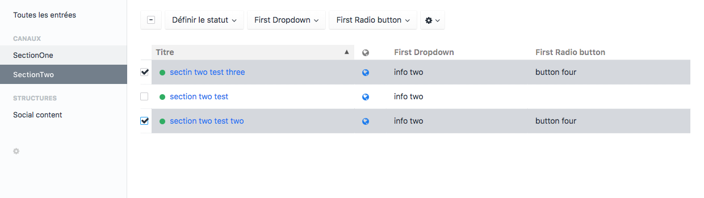

# Craft Bulk Edit plugin for Craft CMS 3.x


## Requirements

This plugin requires Craft CMS 3.0.0-beta.23 or later.

## Installation

To install Craft Bulk Edit, follow these steps:

1. Install with Composer via composer require kffein/craft-bulk-edit from your project directory
2. Install plugin in the Craft Control Panel under Settings > Plugins

Or

You can also install Craft Bulk Edit via the Plugin Store in the Craft AdminCP.

## Configuration

Create a craft-bulk-edit.php file in config/ directory and return an array of sections and fields handle e.g. :

```php
<?php
return [
 'addEditFieldAction' => [
    'sectionTwo' => [
      'firstDopdown',
      'firstRadioButton'
    ]
  ]
];
```

## Preview



## Supported Field

- Dropdown
- Radio Button
- Categories